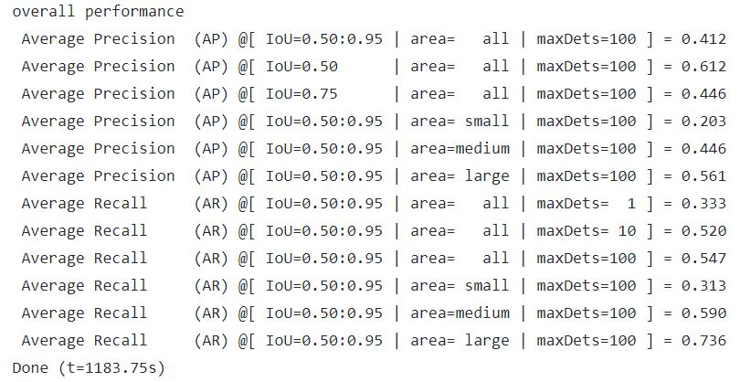
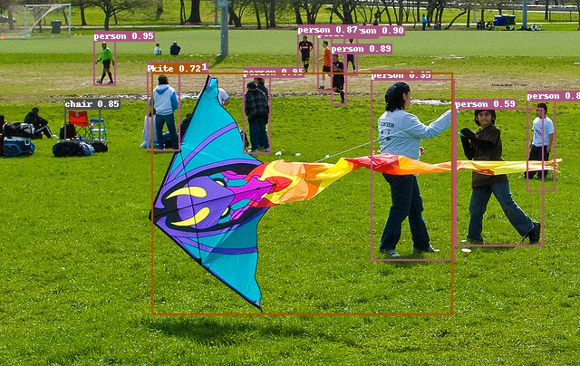

# Paddle-YOLOv4

[English](./README.md) | 简体中文

## 一、简介

本项目基于paddlepaddle_v2.1框架复现YOLOv4。YOLOv4是YOLO系列的第四代模型，其在保留YOLOv3检测头编解码方式的同时，通过使用更强的主干网络、更强的特征融合模块、以及更多的数据增强方式，让模型性能相比于YOLOv3有显著的提高，且推理速度仍然很快。

**论文:**
- [1] Bochkovskiy A,Wang C Y,Liao H.YOLOv4:Optimal Speed and Accuracy of Object Detection[J].2020.

**参考项目：**
- [https://github.com/AlexeyAB/darknet](https://github.com/AlexeyAB/darknet)

**项目aistudio地址：**
- notebook任务：[https://aistudio.baidu.com/aistudio/projectdetail/2479219](https://aistudio.baidu.com/aistudio/projectdetail/2479219)

## 二、复现精度

该模型是在COCO2017的train集上训练，在COCO2017的testdev集上测试(训练时可以先在val集上验证，用于评估模型训练情况)。

论文中给出的在输入尺寸为416x416时testdev集上的AP为41.2%，本项目得到的AP为41.2%。



## 三、数据集

[COCO数据集](https://aistudio.baidu.com/aistudio/datasetdetail/7122)
- 数据集大小：
  - 训练集：118287张
  - 验证集：5000张
  - testdev集：20288张
- 数据格式：标准COCO格式，矩形框标注

## 四、环境依赖

- 硬件：CPU、GPU（建议使用四卡Tesla V100-32G）

- 框架：
  - PaddlePaddle >= 2.1.2
  
## 五、快速开始

### step1: clone 

```bash
# clone this repo
git clone https://github.com/nuaaceieyty/Paddle-YOLOv4.git
cd Paddle-YOLOv4
export PYTHONPATH=./
```
**安装依赖**
```bash
pip install -r requestments.txt
```

### step2: 训练

1. 在顶层目录下创建output文件夹，并在此处下载主干网络CSPDarkNet的预训练权重（我已经将CSPDarkNet官方提供的转为了pdparams格式），地址为：https://aistudio.baidu.com/aistudio/datasetdetail/103994 。
2. 本项目使用四卡Tesla V100-32G训练，注意：COCO数据集应该提前下好，并且解压到顶层目录下的data目录中（数据集地址为：https://aistudio.baidu.com/aistudio/datasetdetail/7122 ）。如果出现数据集地址问题，请在configs/datasets/coco_detection.yml文件中将相应地址改为绝对路径。

```bash
python -m paddle.distributed.launch --gpus 0,1,2,3 train.py -c configs/yolov4/yolov4_coco.yml --eval
```

### step3: 评估验证
注意：这里一定要确保best_model.pdparams文件在output目录下
```bash
python3 eval.py -c configs/yolov4/yolov4_coco.yml
```

### step4: 生成提交testdev结果
注意：这里一定要确保best_model.pdparams文件在output目录下
```bash
python3 eval.py -c configs/yolov4/yolov4_coco_test.yml
```
将住目录下生成的bbox.json文件压缩成zip格式后，发送至测评服务器

### 使用训练好的模型预测

将需要测试的图片放在目录data中， 运行下面指令，输出图片保存在output目录下；如果机器环境中有GPU，则将命令中 -o use_gpu=False 去掉

```bash
python3 predict.py -c configs/yolov4/yolov4_coco.yml --infer_img data/1.jpg -o use_gpu=False
```
运行结果如下所示：



## 六、代码结构与详细说明

### 6.1 代码结构

```
├─config                          # 配置
├─model                           # 模型
├─data                            # 训练数据及预测图片存放目录
├─output                          # 权重参数及预测结果
│  eval.py                        # 评估
│  predict.py                     # 预测
│  README.md                      # 英文readme
│  README_CN.md                   # 中文readme
│  requirements.txt               # 依赖
│  train.py                       # 训练
```
### 6.2 参数说明

可以在 `train.py` 中设置训练与评估相关参数，具体如下：

|  参数   | 默认值  | 说明 | 其他 |
|  ----  |  ----  |  ----  |  ----  |
| config| None, 必选| 配置文件路径 ||
| --eval| None, 可选| 边训练边验证 |如果不选此项，可能找到best_model会比较麻烦|
| --resume| None, 可选 | 恢复训练 |例如：--resume output/yolov4_coco/66 |

### 6.3 训练流程

详见 五、快速开始

## 七、模型信息

关于模型的其他信息，可以参考下表：

| 信息 | 说明 |
| --- | --- |
| 发布者 | 余天洋（EICAS）|
| 时间 | 2021.10 |
| 框架版本 | Paddle 2.1.2 |
| 应用场景 | 目标检测 |
| 支持硬件 | GPU、CPU |
| 下载链接 | [训练好的模型](https://aistudio.baidu.com/aistudio/datasetdetail/107066)|
| 在线运行 | [notebook](https://aistudio.baidu.com/aistudio/projectdetail/2479219)|
